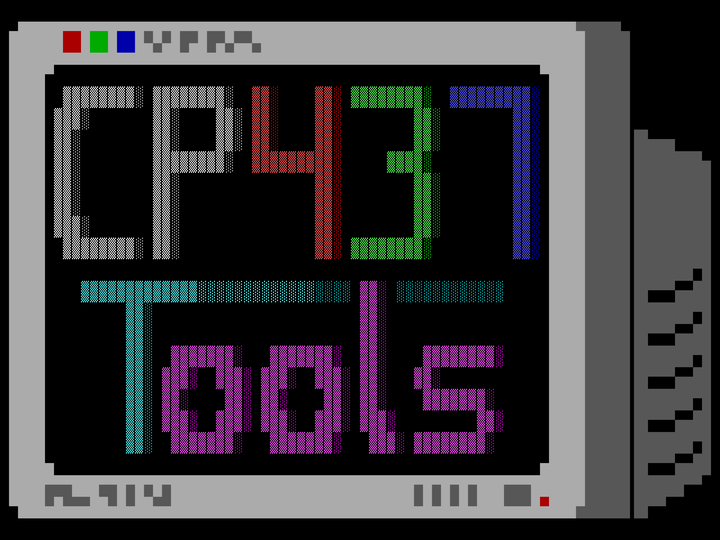

  

  <b>CP437 tools</b>

  A small collection of tools to handle CP437 files.

  <!-- Badges -->
  
  
  
<!-- If this ever makes it to more than just crates.io...
    
  
-->

## Documentation

The documentation for the latest release is available @
[docs.rs](https://docs.rs/cp437-tools)

## Development

The repo comes with a [nix flake](./flake.nix), so simply type `nix develop` and
you'll have a bash terminal with all tools needed for building this codebase.

## Licenses

This project's code is made freely available under the [GPLv3+](./LICENSE.md)
license.

The [fonts](./res/fonts) used are provided by
[int10h.org](https://int10h.org/oldschool-pc-fonts) and redistributed with the
[CC-BY-SA-4.0](./res/fonts/LICENSE) license.
