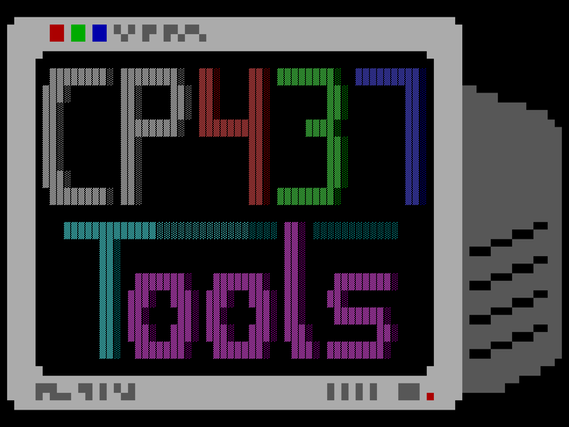
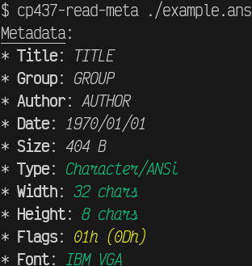
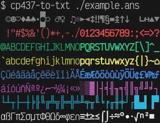
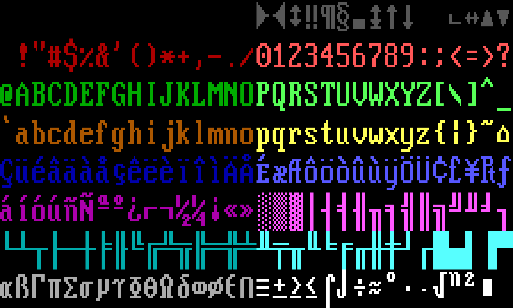

<div align="center">
  <!-- nix run nixpkgs#imagemagick -- logo.png -resize 5% logo.small.png -->
  
</div><div align="center">
  <b>CP437 tools</b>

  A small collection of tools to handle CP437 files.
</div><div align="center">
  <!-- Badges -->
  <a href="https://github.com/kip93/cp437-tools">
    
  </a>
  <a href="https://github.com/kip93/cp437-tools/graphs/commit-activity">
    
  </a>
  <a href="https://github.com/kip93/cp437-tools/commits/main">
    
  </a>
</div>


## Commands

### cp437-read-meta

Prints the metadata of a file to stdout. Useful for finding issues, since it
will highlight potential problems, marking assumptions or default values with
yellow, problems in red, and successes in green. Inconsequential fields are just
shown in the default foreground colour.



### cp437-to-txt

Simply strips metadata and maps CP437 to UTF-8. Takes an optional argument to
the output file, but defaults to showing the result in the terminal.



### cp437-to-png

Renders the CP437 as a PNG image. Takes an optional argument to the output file,
but if not given it allows piping to other programs such as imagemagick.




## lib

While not intended for use as a library, it may still prove useful. Be warned
though that no guarantees are made about the stability of the API.


## Development

The repo comes with a [nix flake](./flake.nix), so simply type `nix develop` and
you'll have a bash terminal with all tools needed for building this codebase.

You have an [example file](./example.ans) for simple tests (the same used for
the screenshots above), but if you need more:

```shell
$ nix build '.#test_files'
$ ls ./result/
comments.ans  large.ans  meta.ans  simple.ans
```


## Licenses

This project's code is made freely available under the [GPLv3+](./LICENSE.md)
license. The [fonts](./res/fonts) used are provided by
[int10h.org](https://int10h.org/oldschool-pc-fonts) under the
[CC-BY-SA-4.0](./res/fonts/LICENSE) license.
