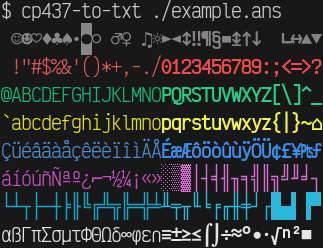
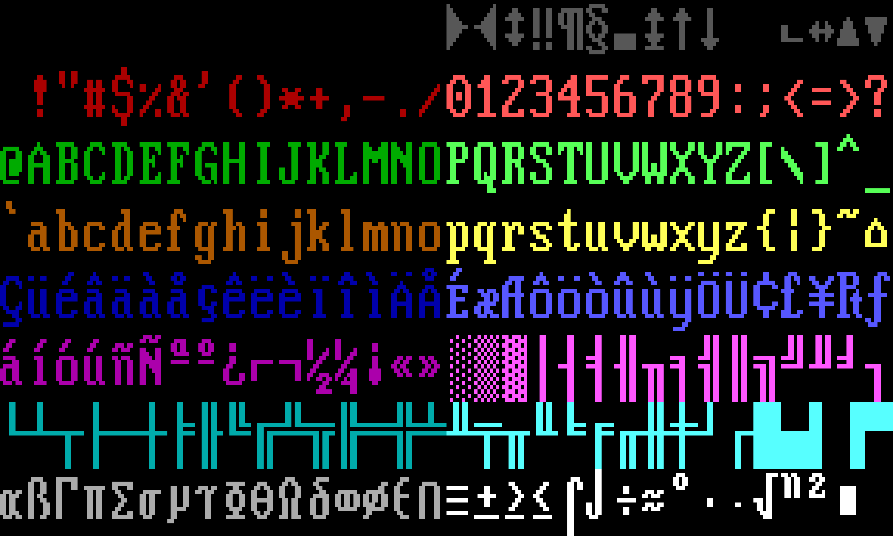

# CP437 tools

A small collection of tools to handle CP437 files.


## Commands

### cp437-to-txt

Simply strips metadata and maps CP437 to UTF-8. Takes an optional argument to
the output file, but defaults to showing the result in the terminal.



### cp437-to-png

Renders the CP437 as a PNG image. Takes an optional argument to the output file,
but if not given it allows piping to other programs such as imagemagick.




## lib

While not intended for use as a library, it may still prove useful. Be warned
though that no guarantees are made about the stability of the API.


## Development

The repo comes with a [nix flake](./flake.nix), so simply type `nix develop` and
you'll have a bash terminal with all tools needed for building this codebase.

You have an [example file](./example.ans) for simple tests (the same used for
the screenshots above), but if you need more:

```shell
$ nix build '.#test_files'
$ ls ./result/
comments.ans  large.ans  meta.ans  simple.ans
```


## Licenses

This project's code is made freely available under the [GPLv3+](./LICENSE.md)
license. The [fonts](./res/fonts) used are provided by
[int10h.org](https://int10h.org/oldschool-pc-fonts) under the
[CC-BY-SA-4.0](./res/fonts/LICENSE) license.
